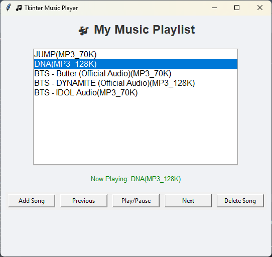

# 🎵 Tkinter Music Player

A desktop music player application built using Python's Tkinter GUI toolkit and Pygame for audio playback. It also uses a MySQL database to manage song metadata.

## 🚀 Features

- Play/Pause music
- Next/Previous song navigation
- Add and delete songs from the playlist
- Songs stored and loaded using MySQL
- GUI playlist and playback status display

## 💻 Technologies Used

- Python 3.12+
- Tkinter
- Pygame
- PyMySQL
- MySQL

## 📦 Requirements

Install the required packages using:

```
pip install -r requirements.txt
```

## 🛠️ Setup

1. Clone this repository
2. Create a MySQL database named `music_player`
3. Create a `songs` table using the following schema:

```sql
CREATE TABLE songs (
    id INT AUTO_INCREMENT PRIMARY KEY,
    title VARCHAR(255),
    duration VARCHAR(50),
    file_path TEXT
);
```

4. Update the `DatabaseManager` class in `music_player.py` if needed with your DB credentials.
5. Run the GUI:

```
python music_player_gui.py
```

## 🖼️ Screenshot



---

Made with ❤️ using Python
